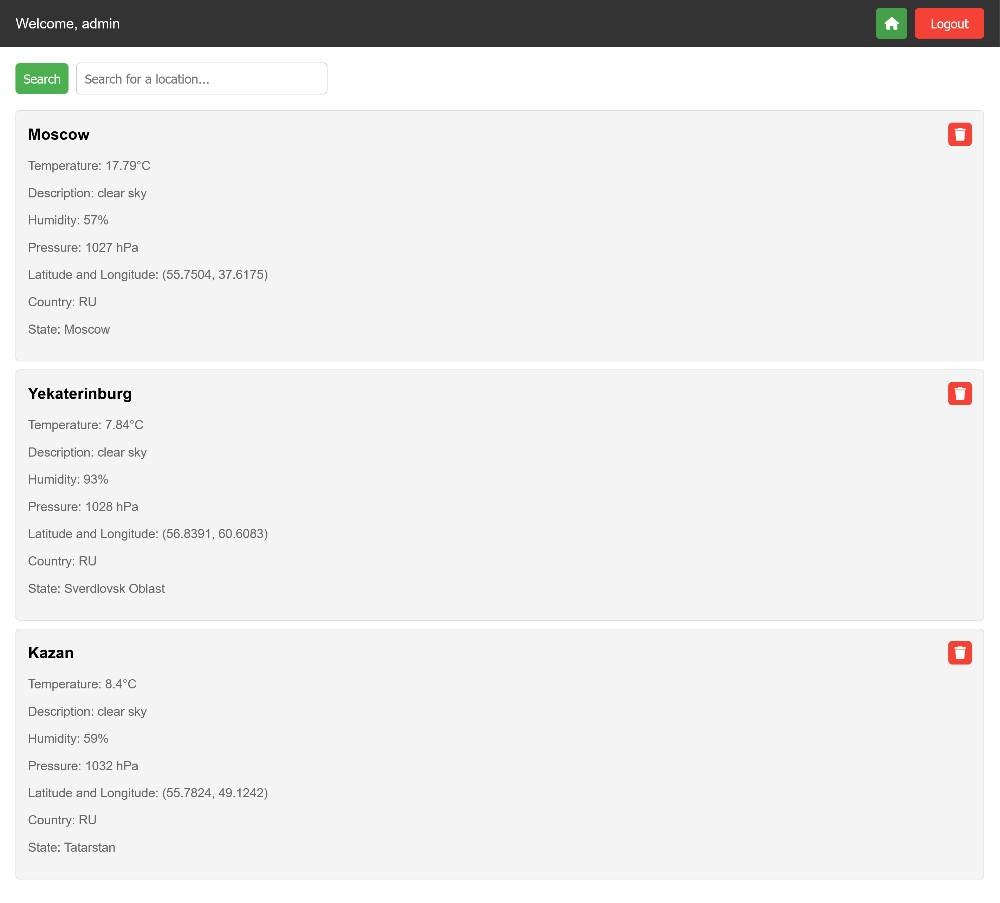

# Project "Weather Viewer"

## Description
The application displays weather information for locations selected by the user. To view locations, the user needs to register with a custom username, search for and subscribe to the desired locations. After that, the weather forecast for the selected locations will be displayed on the homepage.

Weather data is requested from the OpenWeatherMap service (https://openweathermap.org/) via API.

#### User services provided by the application
- Registration
- Login
- Logout

#### Weather display services provided by the application
- Location search
- Adding a location to the weather forecast list
- Removing a location from the weather forecast list
- Displaying a list of locations with weather forecasts

#### Technologies Used in Development:
* Frontend: HTML/CSS/JS
* Backend:
  * Java
  * Maven
  * Jakarta Servlet
  * Lombok
  * Thymeleaf
  * Spring Security (password encryption)
  * Jackson
  * Hibernate
  * JUnit
  * Mockito
  * Log4j
  * AssertJ
* Databases: PostgreSQL

## Deployment on your local machine
1. Clone the repository
2. Create a PostgreSQL database with name `weatherViewerDB` and user `postgres` with password `postgres`
3. Create the same database but with name `weatherViewerDB_test` for the test environment
4. Download the latest version of the Apache Tomcat server(10.x.x) and add it to the project
5. Add `API_KEY` to the environment variables of your project with the value of your OpenWeatherMap API key
6. **_!!! Don't forget to change application context in tomcat configuration in order to get correct URL mappings_**
7. Run the project on the Tomcat server